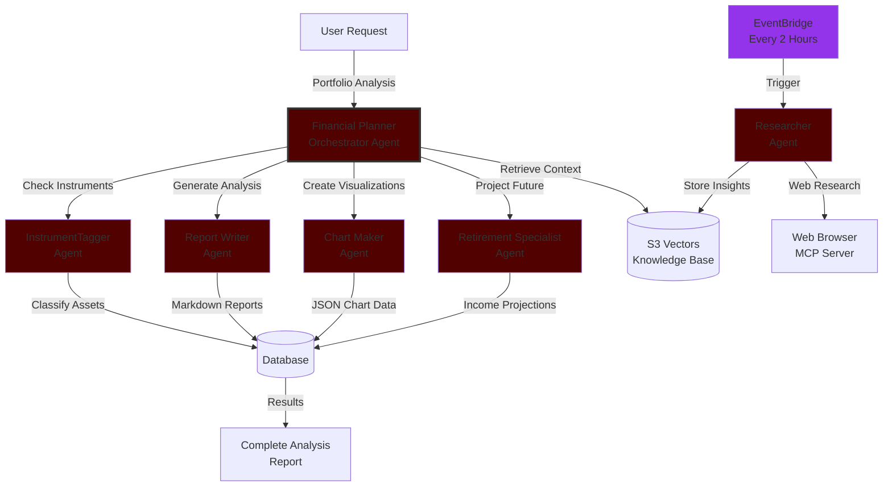

# 🧠 Alex – The AI Financial Advisor  

🌐 [Live link](https://d2zvcu31a3zafz.cloudfront.net/)
☕ Heads-up: the live demo sometimes takes a budget-induced coffee break (AWS caps). If it’s snoozing, run it locally—see [dev_setup.md](./docs/dev_setup.md).

**Alex** is an **AI-powered financial advisor** that delivers personalized portfolio analysis, market insights, and retirement planning through a collaborative team of specialized AI agents.

It combines **AWS’s serverless infrastructure** with **agentic orchestration**, **explainable reasoning**, and **enterprise-grade security, monitoring, and observability** — creating a platform that’s powerful, scalable, and cost-efficient

Alex automatically researches financial markets, enriches knowledge through embeddings, and produces rich and comprehensive financial analysis for end users' portfolios according to their settings which can include parameters such as total years until retirement, annual income after retirement and many more.

---

## 📘 Comprehensive READMEs

| Guide | Description |
|-------|-------------|
| [Big Picture - Agentic Architecture](./docs/agentic_architecture.md) | Overview of the Agents being used |
| [AWS Deployment Infrastructure](./docs/architecture.md) | AWS Infrastructure used for deplyment|
| [Developer setup](./docs/dev_setup.md) | Instructions for developer setup |
| [UI](./docs/ui_guide.md) | Screenshots and user instructions |

---

## 🚀 Key Features
- AI financial advising platform powered by **AWS Bedrock, Sagemaker**
- Multi-agent orchestration for **research, reporting, visualization, and projections**
- Fully serverless architecture built on **AWS Lambda, S3, API Gateway, and Aurora**
- Infrastructure as Code with **Terraform**
- **Secure, observable, and scalable** with LangFuse and CloudWatch integration

---

## Agent Collaboration Overview

---

## Current AWS Architecture for Deployment

---
## 🧑‍💻 Tech Stack
**Frontend:** Next.js, Tailwind CSS, Clerk  
**Backend:** FastAPI, Python 3.12  
**AI/ML:** AWS Bedrock, SageMaker, LangFuse  
**Infrastructure:** Terraform, AWS Lambda, S3, CloudFront, Aurora, API Gateway  

---

