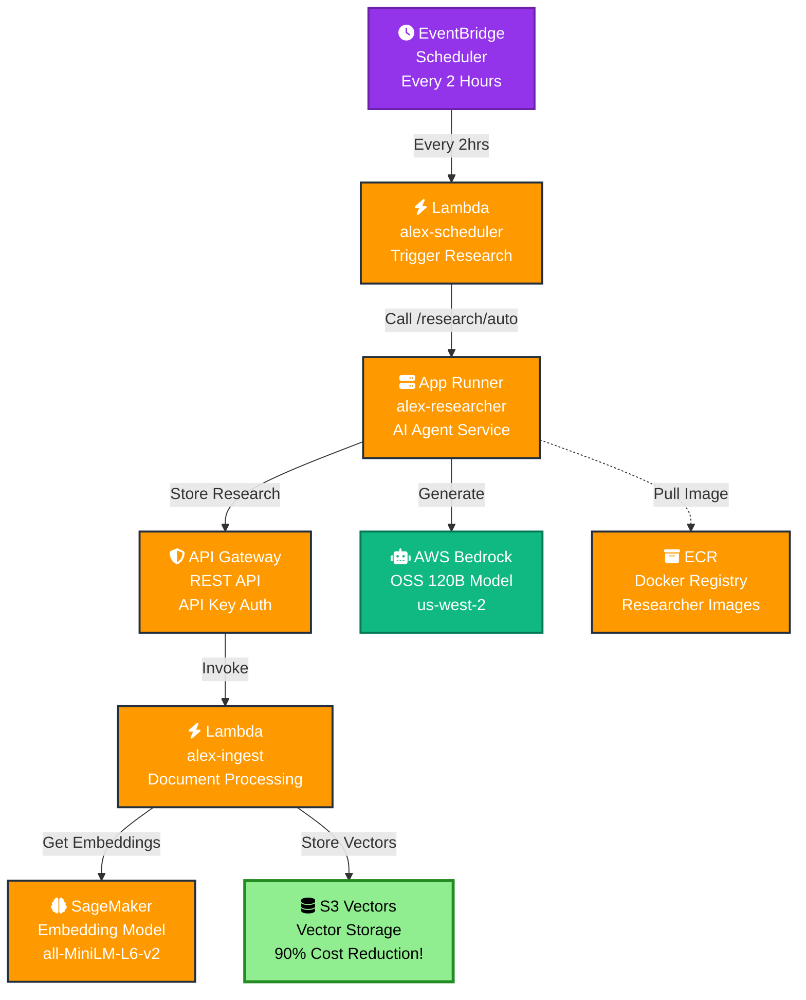
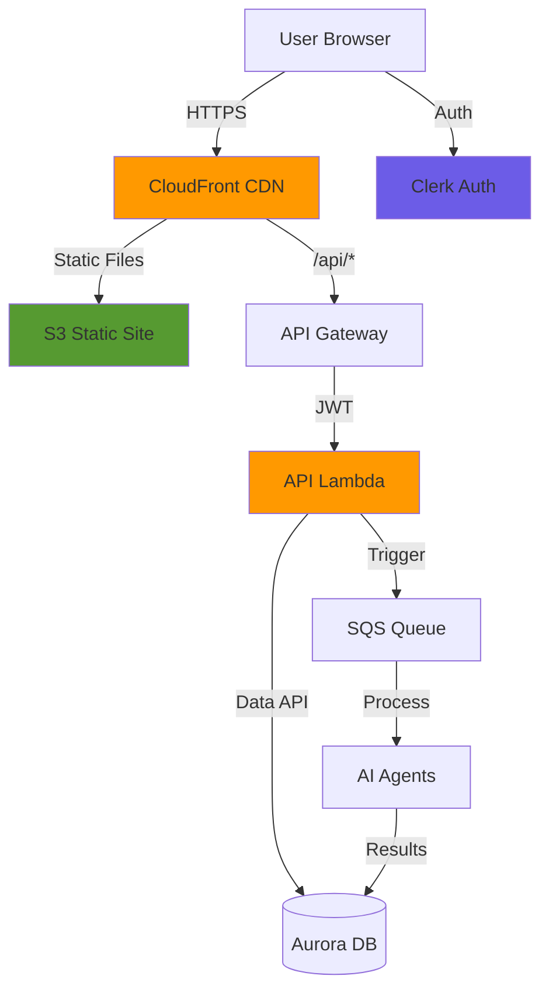

# Alex AWS Infrastructure Overview
The Alex platform uses a modern serverless architecture on AWS, combining AI services with cost-effective infrastructure:

---

## System Architecture of Researcher Agent

As shown in the image above, there are mainly 6 Agents. Planner, Tagger, Reporter, Charter and Retirement analyser are deployed using AWS Lambda. On the other hand, Researcher agent which runs every two hours is deployed using AWS AppRunner and the detailed diagram of which is shown below:

## Component Details

### 1. **S3 Vectors** (90% Cost Reduction)
- **Purpose**: Native vector storage in S3
- **Features**: 
  - Sub-second similarity search
  - Automatic optimization
  - No minimum charges
  - Strongly consistent writes
- **Cost**: ~$30/month (vs ~$300/month for OpenSearch)
- **Scale**: Millions of vectors per index

### 2. **API Gateway**
- **Type**: REST API
- **Auth**: API Key authentication
- **Endpoints**: `/ingest` (POST)
- **Purpose**: Secure access to Lambda functions

### 3. **Lambda Functions**
- **alex-ingest**: Processes documents and stores embeddings
  - Runtime: Python 3.12
  - Memory: 512MB
  - Timeout: 30 seconds
- **alex-scheduler**: Triggers automated research
  - Runtime: Python 3.11
  - Memory: 128MB
  - Timeout: 150 seconds

### 4. **App Runner**
- **Service**: alex-researcher
- **Purpose**: Hosts the AI research agent
- **Resources**: 1 vCPU, 2GB RAM
- **Features**: Auto-scaling, HTTPS endpoint

### 5. **SageMaker Serverless**
- **Model**: sentence-transformers/all-MiniLM-L6-v2
- **Purpose**: Generate 384-dimensional embeddings
- **Memory**: 3GB
- **Concurrency**: 10 max

### 6. **EventBridge Scheduler**
- **Rule**: alex-research-schedule
- **Schedule**: Every 2 hours
- **Target**: alex-scheduler Lambda
- **Purpose**: Automated research generation

### 7. **AWS Bedrock**
- **Provider**: AWS Bedrock
- **Model**: OpenAI OSS 120B (open-weight model)
- **Region**: us-west-2 (model only available here)
- **Purpose**: Research generation and analysis
- **Features**: 128K context window, cross-region access

## Security Features

- **API Gateway**: API key authentication
- **IAM Roles**: Least privilege access
- **S3 Vectors**: Always private (no public access)
- **App Runner**: HTTPS by default
- **Secrets**: Environment variables for API keys

## Technology Stack

- **Infrastructure**: Terraform
- **Compute**: Lambda, App Runner
- **AI/ML**: SageMaker, AWS Bedrock
- **Storage**: S3 Vectors
- **API**: API Gateway
- **Languages**: Python 3.12
- **Container**: Docker

## Key Advantages of S3 Vectors

1. **Cost**: 90% reduction vs traditional vector databases
2. **Simplicity**: Just S3 - no complex infrastructure
3. **Scale**: Handles millions of vectors
4. **Performance**: Sub-second queries
5. **Integration**: Native AWS service

---

## Frontend & API

This section describes the deployment of frontend part - a modern React application with real-time agent visualization, portfolio management, and comprehensive financial analysis displays.

### SaaS frontend with:
- **Authentication**: Clerk-based sign-in/sign-up with automatic user creation
- **Portfolio Management**: Add accounts, track positions, edit holdings
- **AI Analysis**: Trigger and monitor multi-agent analysis with real-time progress
- **Interactive Reports**: Markdown reports, dynamic charts, retirement projections
- **Production Infrastructure**: CloudFront CDN, API Gateway, Lambda backend

Here's the complete architecture:

---