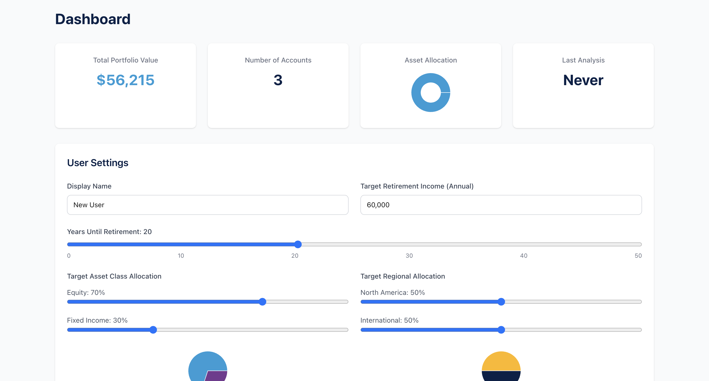

# Alex – UI & Usage Guide

This guide provides an overview of the user interface and demonstrates how to interact with the AI assistant.

---

## 💻 Overview
Alex offers an intuitive dashboard and AI-assisted analysis features for managing portfolios, viewing insights, and generating financial reports.

---

## 🖼️ Screenshots

| Section | Description | Screenshot |
|----------|--------------|-------------|
| Homepage | Landing page introducing the AI-powered financial advisor |  |
| Get Started | Sign-in & onboarding via Clerk authentication |  |
| Dashboard | User settings and retirement preferences |  |
| Accounts | Manage accounts, positions, and total portfolio value |  |
| Positions | Add, edit, or delete investment positions |  |
| Agents Board | View specialized AI advisory agents |  |
| Analysis Overview | Executive summary of portfolio analysis |  |
| Analysis Charts | Charts and visual breakdown of investments |  |
| Analysis Projections | Retirement readiness and Monte Carlo results |  |

---

## 🧭 How to Use
1. Visit the [Live Site](YOUR_LIVE_URL)
2. Sign up or log in using **Clerk Authentication**
3. Add investment accounts and positions. You can also Add Test Portfolio Data

    3.1 Navigate to Accounts Page

    1. Click **Accounts** in the navigation bar
    2. You'll see "No accounts found"
    3. Click **Populate Test Data** button

    The system creates:
    - 3 accounts (401k, Roth IRA, Taxable)
    - Various ETF and stock positions
    - Cash balances

    3.2 Explore Account Management

    Click on any account to:
    - View positions with current values
    - Edit position quantities
    - Add new positions
    - Delete positions
    - Update cash balance

    Try editing a position:
    1. Click the edit icon next to any position
    2. Change the quantity
    3. Click save
    4. See the value update automatically

4. Launch an AI-powered **Portfolio Analysis**
5. View your **Analysis Report**, **Charts**, and **Retirement Projections**

**Note**: The AI analysis features require the AWS infrastructure to be deployed. You can explore portfolio management locally, but analysis will only work after deployment.

---

## ⚙️ Technology Behind the UI
- **Next.js 15** – React-based frontend framework  
- **Tailwind CSS** – For a clean and responsive design  
- **Clerk** – Authentication & user management  
- **Recharts** – Interactive data visualizations  

---

## 🔒 Notes
- All AI-generated insights are for informational purposes only.  
- This system does not provide licensed financial advice.
